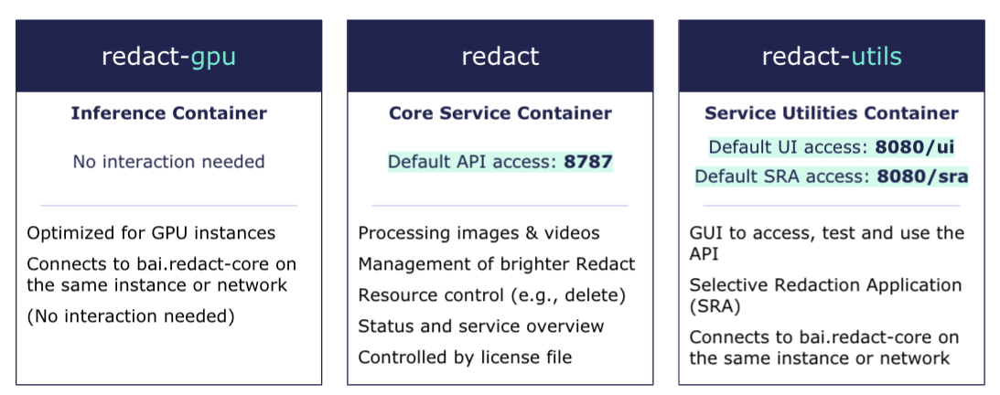

[](https://brighter.ai/)

# Orchestrate/run brighter Redact Enterprise

This MIT-licensed repository provides tools to start/stop an instance of brighter Redact
Enterprise. It references proprietary brighter AI containers for which a commercial license is
required. Please contact hello@brighter.ai for obtaining a license.

brighter Redact Enterprise consists of three redact containers which are run by docker-compose.

Automatic starting and stopping can be set up via systemd, see below.

## brighter Redact Enterprise

brighter Redact Enterprise is an ecosystem comprising of three containers. The three containers - redact, redact-gpu and redact-utils are described in the architecture below.


## Further information

* [brighter documentation website](https://docs.brighter.ai/), covering introduction, requirements, API, and more
* [Release notes on documentation website](https://docs.brighter.ai/docs/release-notes)

## Running brighter Redact services

### Prerequisites

Log in to the brighter AI docker registry with your credentials:

`docker login docker.brighter.ai -u enterprise -p <api-key>`

Make sure you have access to your redact license file. For this guide, we'll assume that it's stored in this project and named `./license.bal`

| Usage-based licenses | If you're using a usage-based license you must have an active internet connection at all times or run the Redact-License-Server!       |
|-------------|:------------------------|

## Starting brighter Redact Enterprise

0. (optional) Change the default configuration as described [below](#configuration)

1. Start redact in default configuration by running:
`./start_redact.sh`

2. Start anonymizing using the ui ( http://$HOSTIP:8080/ui ), sra ( http://$HOSTIP:8080/sra ), or the flassger interface( http://$HOSTIP:8787 ).

3. Redact can be shut down with the following script:
`./stop_redact.sh`

IMPORTANT: The scripts require to run docker compose under the command `docker compose`. That is compose v2 and the compose plugin for docker. In compose v1 one needed to run `docker-compose`. [More](https://docs.docker.com/compose/migrate/).


### Configuration

The configuration of the docker-compose setup can be changed within the [docker-compose.env](./docker-compose.env) file.

#### Redact Docker Images

``` bash
REDACT_IMAGE=...
REDACT_GPU_IMAGE=...
REDACT_UTILS_IMAGE=...
```

#### GPU Optimized Images

The following GPU-specific containers exist, and can be used only with the specified GPU type for speed improvements:

| Standard Image   | T4 Optimized Image            | A100 Optimized Image            | 2080TI Optimized Image     | A10 Optimized Image        |
|------------------|-------------------------------|---------------------------------|----------------------------|----------------------------|
| redact-gpu:3.3.0 | redact-gpu:3.3.0-T4           | redact-gpu:3.3.0-A100           | redact-gpu:3.3.0-2080ti    | redact-gpu:3.3.0-A10       |
| redact-gpu:3.2.0 | redact-gpu:3.2.0-T4           | redact-gpu:3.2.0-A100           | redact-gpu:3.2.0-2080ti    |                            |
|                  |                               |                                 |                            | redact-gpu:3.1.1-A10       |
| redact-gpu:3.1.0 | redact-gpu:3.1.0-T4           | redact-gpu:3.1.0-A100           | redact-gpu:3.1.0-2080ti    |                            |
| redact-gpu:3.0.0 | redact-gpu:3.0.0-T4           | redact-gpu:3.0.0-A100           | redact-gpu:3.0.0-2080ti    |                            |
| redact-gpu:2.8.0 | redact-gpu:2.8.0-T4           | redact-gpu:2.8.0-A100           | redact-gpu:2.8.0-2080ti    |                            |
| redact-gpu:2.7.0 | redact-gpu:2.7.0-T4           | redact-gpu:2.7.0-A100           | redact-gpu:2.7.0-2080ti    |                            |
| redact-gpu:2.6.1 | redact-gpu:2.6.1-T4           | redact-gpu:2.6.1-A100           | redact-gpu:2.6.1-2080ti    |                            |
| redact-gpu:2.6.0 | redact-gpu:2.6.0-T4           | redact-gpu:2.6.0-A100           | redact-gpu:2.6.0-2080ti    |                            |
| redact-gpu:2.5.1 | redact-gpu:2.5.1-T4           | redact-gpu:2.5.1-A100           | redact-gpu:2.5.1-2080ti    |                            |
| redact-gpu:2.5.0 | redact-gpu:2.5.0-T4           | redact-gpu:2.5.0-A100           | redact-gpu:2.5.0-2080ti    |                            |
| redact-gpu:2.4.0 | redact-gpu:2.4.0-optimized-T4 | redact-gpu:2.4.0-optimized-A100 |                            |                            |
| redact-gpu:2.3.1 | redact-gpu:2.3.1-trt-T4       |                                 |                            |                            |

This applys to the `REDACT_GPU_IMAGE` located in `docker-compose.env`

#### Ports

``` bash
REDACT_API_PORT=...
REDACT_UI_PORT=...
```

#### REDACT_LICENSE_FILE

The location and name of the local redact license file can be changed with the following environment variable:

``` bash
REDACT_LICENSE_FILE=...
```

#### GPU_IDS

Simply change the `GPU_IDS` variable to select your desired GPUs.\
E.g.:

- `GPU_IDS=0,1,2` for GPUs with IDs 0, 1 and 2
- `GPU_IDS=all` for all GPUs.

See [here](https://docs.nvidia.com/datacenter/cloud-native/container-toolkit/user-guide.html#gpu-enumeration) for more information.

#### Disabling Features

Disabling features can be used to reduce memory consumption and lowering the idle load.

``` bash
DISABLE_FACES={true | false}
DISABLE_LICENSE_PLATES={true | false}
DISABLE_PERSONS={true | false}
DISABLE_BLUR={true | false}
DISABLE_DNAT={true | false}
```

#### Retrieving Error Logs

If there are any issues with processing files, the error logs of all micro-services can be downloaded and sent to Brighter AI for further investigation.

To download the error logs, run `./download_logs.sh` and send the output zip file (`redact_logs.zip`) to Brighter AI

#### Installing as a Service

To install Redact Enterprise as a systemd service, use the `./install.sh` script and supply an installation directory. For example, `sudo ./install.sh /etc/redact` will create the `redact` directory under `/etc` and install the systemd service. To uninstall, run `sudo ./uninstall.sh /etc/redact` using the same directory as an argument that was used during installation. Uninstalling the service also stops the service, which can take up to a minute.

After installing the service, the `start_redact.sh` and `stop_redact.sh` scripts should no longer be needed.

After running the installation script, the service can be started with `sudo systemctl start redact.service` and stopped with `sudo systemctl stop redact.service`. Starting the service for the first time may take a few minutes, since the docker images may need to be downloaded.

To allow systemd to manage the service, run `sudo systemctl enable redact.service`. This will tell systemd to start the service if the machine which it is running on is rebooted. **During restarts, all processing and processed data will be lost.**

The service can be disabled using `sudo systemctl disable redact.service`. This will tell systemd not to manage the service anymore, but will not stop the service. `sudo systemctl stop redact.service` will still need to be run to stop the service. Whether or not the service is enabled can be checked with `sudo systemctl is-enabled redact.service`.

The current health and status of the service can be seen by running `sudo systemctl status redact.service`, all logs of the systemdstatus can be retrieved by `journalctl -u redact.service` and the status of the docker containers themselves can be seen by running `docker ps` and interacting with the `redact` and `redact-gpu` containers.

### Other command flags for start_redact.sh

#### -a (attach) flag

The `-a` flag is recommended to run the containers in attached mode, aka launch in foreground.
You can combine this with the graphical user interface by adding the `-u` flag
`./start_redact.sh -au`

#### -u (UI or utils) flag

This flag is indicating that the utils container should be started, which
contains notably the UI functionality.
