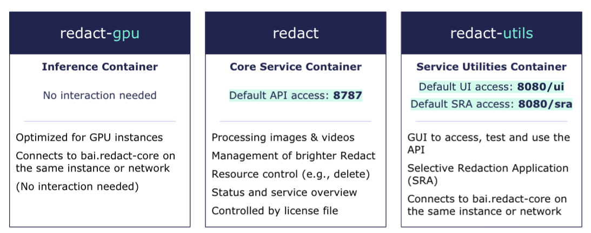

# Running brighter Redact Enterprise
Start an instance of brighter Redact Enterprise, consisting of three redact containers which are managed by docker-compose.


## brighter Redact Enterprise
brighter Redact Enterprise is an ecosystem comprising of three containers which are managed by docker-compose. The three containers - redact, redact-gpu and redact-utils are described in the architecture below.


## Running brighter Redact services
### Prerequisites
Log in to the brighter AI docker registry with your credentials:

`docker login docker.brighter.ai`

Make sure you have access to your redact license file. For this guide, we'll assume that it's stored within the same folder as the docker-compose.yaml file and named `./license.bal`

| Usage-based licenses | If you're using a usage-based license you must have an active internet connection at all times!       |
|-------------|:------------------------|

## Starting brighter Redact Enterprise

1. Start redact in default configuration by running:
`./start_redact.sh`

2. Start anonymizing using the ui ($HOSTIP:8080/ui), sra ($HOSTIP:8080/sra), or flassger interface($HOSTIP:8787).

3. Redact can be shut down with the following script:
`./stop_redact.sh`

### Configuration
The configuration of the docker-compose setup can be changed within the [docker-compose.env](./docker-compose.env) file.

#### Redact Docker Images
```
REDACT_PIPELINE_IMAGE=...
REDACT_INFER_IMAGE=...
REDACT_UTILS_IMAGE=...
```
#### Ports
```
REDACT_API_PORT=...
REDACT_UI_PORT=...
```
#### License File
The location and name of the local redact license file can be changed with the following environment variable:
```
REDACT_LICENSE_FILE=...
```
#### Limiting GPUs
Simply change the `GPU_IDS` variable to select your desired GPUs.\
E.g.:
- `GPU_IDS=0,1,2` for GPUs with IDs 0, 1 and 2
- `GPU_IDS=all` for all GPUs.

See [here](https://docs.nvidia.com/datacenter/cloud-native/container-toolkit/user-guide.html#gpu-enumeration) for more information.
